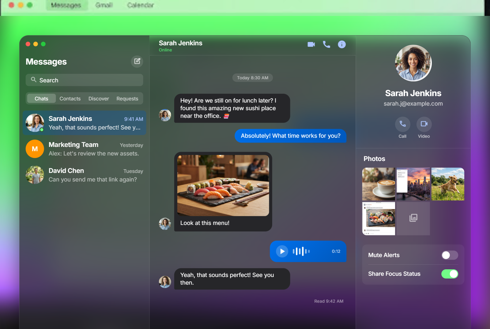
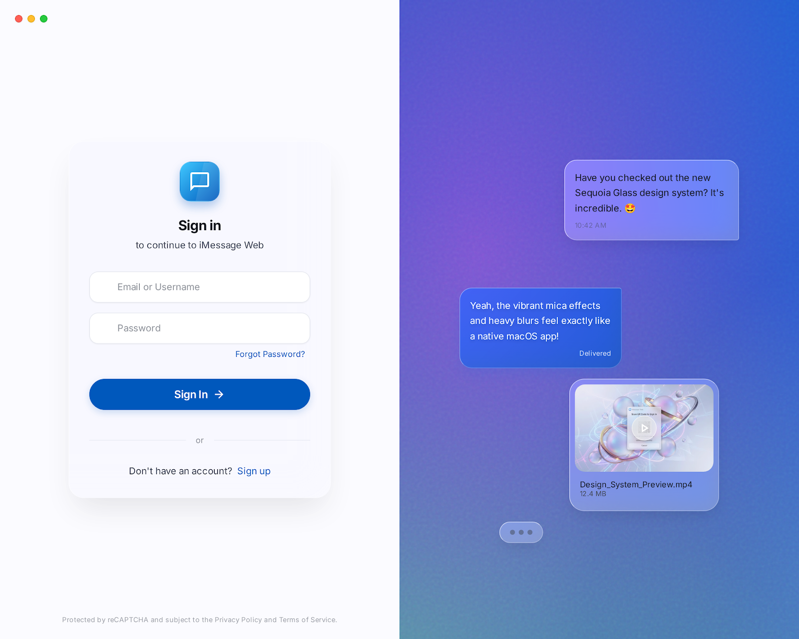
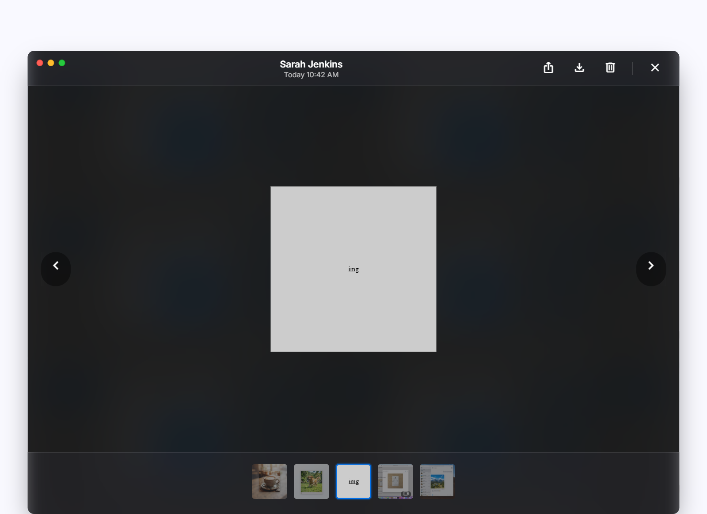
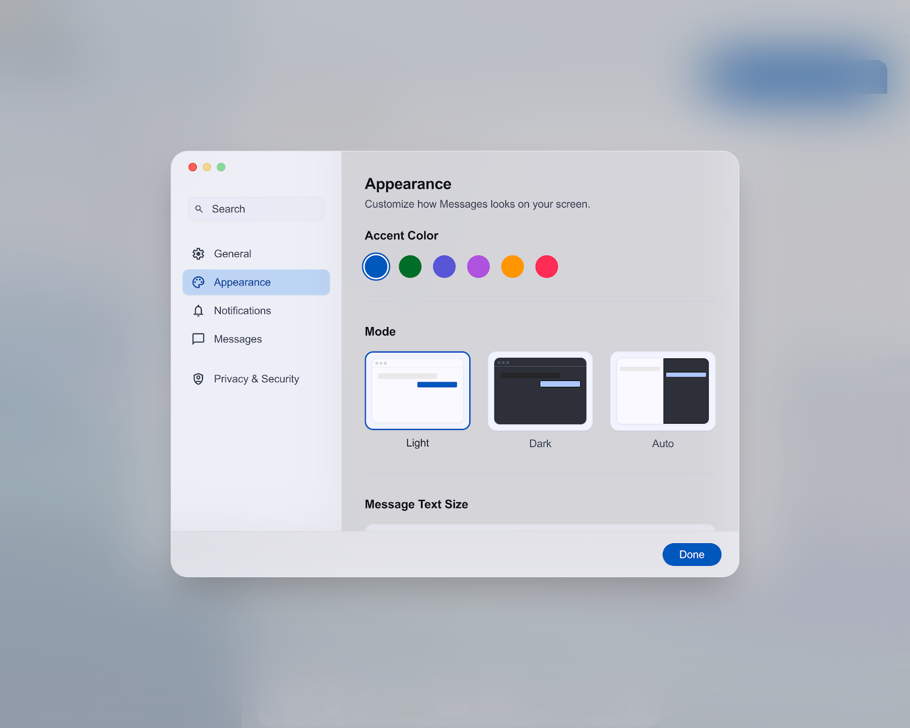

<div align="center">

# 💬 iMessage Web

### *Next-Generation Real-Time Web Messenger Crafted with Apple macOS Sequoia & iOS 18 Glassmorphism*

[](https://github.com/Deadshot-45/iMessage/actions/workflows/ci-cd.yml)
[](https://react.dev/)
[](https://www.typescriptlang.org/)
[](https://tailwindcss.com/)
[](https://expressjs.com/)
[](https://socket.io/)
[](https://mongoosejs.com/)
[](https://clerk.com/)

[Live Demo](#-docker-deployment) • [Architecture](#-system-architecture) • [Features](#-key-features) • [Getting Started](#-getting-started) • [API & Sockets](#-api--socket-events)

---

</div>

## 📖 Overview

**iMessage Web** is a production-ready, cloud-native real-time chat application inspired by Apple's iconic iMessage on macOS Sequoia and iOS 18. Built from the ground up for high concurrency, low latency, and fluid micro-interactions, it delivers a desktop-grade messaging experience in any modern web browser.

### ✨ Highlights
- 🪟 **macOS Sequoia Floating Window**: Standalone frosted-glass cards with dynamic Mica translucency, backdrop blurs, and Apple traffic lights.
- ⚡ **Real-Time Synchronous Core**: Instant bi-directional messaging with Socket.io, optimistic UI updates, and zero perceptible latency.
- 🖼️ **Progressive Media Engine**: Seamlessly send images, 4K videos, audio waveforms, and animated GIFs with ImageKit integration and a full-screen Lightbox viewer.
- 👥 **Friendship & Contact Graph**: Real-time friend discovery, pending request badges, live online presence, and instant contact acceptance.
- 🎨 **Adaptive Themes & Wallpapers**: Switch between Sequoia Aurora Neon, classic macOS wallpapers, light/dark modes, and 6 custom Apple accent color schemes.
- 📱 **Adaptive Responsive Design**: 3-panel split view on desktop (`lg:` screens), expandable full-width chat when sidebar is collapsed, and full-screen modals on mobile.

---

## 📸 Screenshots & UI Preview

| macOS Sequoia Dark Theme | Light Theme Sign-In |
|:---:|:---:|
|  |  |

| Media Lightbox Viewer | Settings & Personalization |
|:---:|:---:|
|  |  |

---

## 🚀 Key Features

### 1. 💬 Modern Messaging Engine
- **Three-Tier Delivery State Machine**:
  - `✓` **Sent** (Single gray tick): Message safely stored in database.
  - `✓✓` **Delivered** (Double gray tick): Message delivered to recipient's client.
  - `✓✓` **Read / Seen** (Double electric cyan tick): Recipient opened and viewed the chat.
- **Optimistic UI Updates**: 0ms local state updates with background queue synchronization.
- **Live Typing Indicators**: 3-dot pulsing animated bubble indicating active conversation partners.
- **Message Management**: Inline deletion with tombstone placeholders (`🚫 This message was deleted`).

### 2. 🎬 Progressive Media Engine
- **Image & Video Compression**: Client-side smart canvas compression before upload.
- **Multi-Format Support**: High-resolution photos, MP4/WebM videos, audio waveforms, and GIFs.
- **Upload & Download State Handling**: Dynamic progress bars, blurred thumbnail placeholders, and download-on-demand previews.
- **Immersive Lightbox**: Full-screen modal with multi-asset gallery navigation, zoom, and direct download.

### 3. 👥 Social Network & Friend System
- **Discovery Tab**: Real-time user debounced search across full database.
- **Pending Requests & Badges**: Live counters with instant push toast and notification sound effects.
- **Contact Management**: Instant acceptance/decline flow updating conversations without reload.

### 4. 🎨 macOS Personalization Studio
- **Dynamic Wallpapers**: Includes *Sequoia Aurora*, *Sonoma Horizon*, *Ventura Bloom*, *Monterey Glow*, *Big Sur Glass*, *Dark Nebula*, and *Minimal Glass*.
- **Accent Color Themes**: *Classic iMessage Blue*, *Electric Purple*, *Emerald Mint*, *Sunset Amber*, *Rose Pink*, and *Cyber Cyan*.
- **macOS Sound Pack**: Authentic Apple click, sent, received, and alert audio feedback.

---

## 🏗️ System Architecture

```
                                  +-------------------+
                                  |   Clerk Auth V5   |
                                  +---------+---------+
                                            | (JWT / Webhooks)
                                            v
+------------------+             +--------------------+             +------------------+
|                  |   HTTP REST |                    |   Mongoose  |                  |
|  React 19 / Vite | <=========> |   Node.js / Express| <=========> |  MongoDB Atlas   |
|   Tailwind v4    |             |   TypeScript API   |             |                  |
|  Zustand Store   | < - - - - - |                    |             +------------------+
|                  |  WebSocket  |   Socket.io Engine |
+------------------+ (Socket.io) +---------+----------+
                                            |
                                            v
                                  +-------------------+
                                  | ImageKit Media CDN|
                                  +-------------------+
```

### Modular Performance Architecture
- **Decentralized Zustand Slices**: Child components (`Sidebar`, `ChatPanel`, `DetailsPanel`) consume localized store selectors, preventing unnecessary top-level re-renders.
- **Code Splitting & Lazy Loading**: Modals (`SettingsModal`, `MediaViewerModal`) load on demand using `React.lazy` and `Suspense`.
- **Vendor Chunk Splitting**: Rollup splits heavy dependencies (`@clerk/react`, `react-dom`, `lucide-react`, core state utilities) for browser caching.

---

## 📂 Project Structure

```
iMessage/
├── .github/
│   └── workflows/
│       └── ci-cd.yml                # Automated GitHub Actions CI/CD Pipeline
├── backend/
│   ├── src/
│   │   ├── controllers/             # Auth, message, user, friend controllers
│   │   ├── lib/                     # Database connection, Socket.io server, cron jobs
│   │   ├── models/                  # User, Message, FriendRequest schemas
│   │   ├── routes/                  # Express API route declarations
│   │   ├── weebhooks/               # Clerk user synchronization webhooks
│   │   └── index.ts                 # Express entrypoint & server bootstrap
│   ├── package.json
│   └── tsconfig.json
├── frontend/
│   ├── src/
│   │   ├── components/
│   │   │   ├── auth/                # Sign-in action and hero glass preview
│   │   │   ├── media/               # AudioPlayer, ProgressiveMedia, MediaViewerModal
│   │   │   ├── provider/            # ThemeProvider, WallpaperProvider, AccentProvider
│   │   │   ├── ui/                  # Accessible UI primitives (Dialog, Dropdown, Input)
│   │   │   ├── ChatPanel.tsx        # Message thread & message composer
│   │   │   ├── ConversationItem.tsx # Memoized chat item
│   │   │   ├── DetailsPanel.tsx     # Contact info, shared media & macOS settings
│   │   │   ├── LockScreen.tsx       # Auth lock screen
│   │   │   ├── SettingsModal.tsx    # Preferences & theme customizer
│   │   │   └── Sidebar.tsx          # Navigation, search, tabs, & conversation lists
│   │   ├── hooks/                   # useDebounce, useMediaQuery, useScrollToBottom
│   │   ├── lib/                     # Axios instance, sound manager, image compressor
│   │   ├── pages/
│   │   │   └── Home.tsx             # Responsive 3-panel container orchestrator
│   │   ├── store/                   # Zustand useChatStore & useAuthStore
│   │   ├── types.ts                 # Core TypeScript definitions
│   │   └── main.tsx                 # Root render & Clerk setup
│   ├── package.json
│   ├── vite.config.ts               # Vite configuration with Rollup chunking
│   └── eslint.config.js             # Modern ESLint flat config
├── figma-images/                    # Design assets & reference previews
├── Dockerfile                       # Multi-stage production container build
├── nginx.conf                       # Reverse-proxy configuration for Docker
├── Artitecture.md                   # In-depth architectural & design token specification
└── DESIGN.md                        # Design system & color token reference
```

---

## 🛠️ Tech Stack

### Frontend
- **Framework**: React 19, TypeScript
- **Bundler & Tooling**: Vite 8, Rolldown / Babel React Compiler
- **Styling**: Tailwind CSS v4, Glassmorphism, CSS Variable Tokens
- **State Management**: Zustand v5 (Persisted with Hydration Gate)
- **Authentication**: Clerk React SDK
- **Real-Time Client**: Socket.io Client
- **Icons & Visuals**: Lucide React, Google SF Pro / Geist Fonts
- **Notifications**: React Hot Toast

### Backend
- **Runtime**: Node.js 20+, TypeScript
- **Framework**: Express 5
- **Database**: MongoDB Atlas via Mongoose
- **Real-Time Gateway**: Socket.io 4.8
- **Authentication**: Clerk Express SDK & Webhook verification
- **Media Cloud**: ImageKit Node SDK with Multer multipart streaming
- **Task Scheduling**: Cron

### DevOps & Deployment
- **Containerization**: Multi-stage Dockerfile (Node.js + Nginx)
- **CI/CD**: GitHub Actions (Linting, TypeScript compilation, Docker verification)
- **Hosting**: Render / Cloud VPS

---

## ⚙️ Getting Started

### 📋 Prerequisites
- [Node.js](https://nodejs.org/) `>= 20.0.0`
- [npm](https://www.npmjs.com/) `>= 10.0.0`
- [MongoDB Atlas](https://www.mongodb.com/cloud/atlas) connection string
- [Clerk Developer Account](https://clerk.com/)
- [ImageKit Account](https://imagekit.io/) (for cloud media storage)

---

### 1. Clone the Repository
```bash
git clone https://github.com/Deadshot-45/iMessage.git
cd iMessage
```

---

### 2. Configure Backend Environment
Create a `.env` file in the `backend/` directory:

```env
PORT=3000
MONGODB_URI=mongodb+srv://<username>:<password>@cluster.mongodb.net/imessage?retryWrites=true&w=majority
CLIENT_URL=http://localhost:5173

# Clerk Authentication
CLERK_SECRET_KEY=sk_test_...
CLERK_PUBLISHABLE_KEY=pk_test_...
CLERK_WEBHOOK_SECRET=whsec_...

# ImageKit Media Storage
IMAGEKIT_PUBLIC_KEY=public_...
IMAGEKIT_PRIVATE_KEY=private_...
IMAGEKIT_URL_ENDPOINT=https://ik.imagekit.io/your_id/
```

---

### 3. Configure Frontend Environment
Create a `.env` file in the `frontend/` directory:

```env
VITE_CLERK_PUBLISHABLE_KEY=pk_test_...
VITE_API_URL=http://localhost:3000/api
VITE_SOCKET_URL=http://localhost:3000
```

---

### 4. Install Dependencies & Run

#### Run Backend:
```bash
cd backend
npm install
npm run dev
```

#### Run Frontend (in a separate terminal):
```bash
cd frontend
npm install
npm run dev
```

Open [http://localhost:5173](http://localhost:5173) in your browser.

---

## 📡 API & Socket Events

### REST API Endpoints

| Method | Endpoint | Description | Auth Required |
| :--- | :--- | :--- | :--- |
| `GET` | `/health` | Health check endpoint | No |
| `GET` | `/api/auth/check` | Authenticate user session | Yes |
| `GET` | `/api/users` | List contacts & suggestions | Yes |
| `GET` | `/api/users/search?q=...` | Search users by query | Yes |
| `GET` | `/api/message/conversations` | Get active user conversations | Yes |
| `GET` | `/api/message/:userId` | Get messages with specific user | Yes |
| `POST`| `/api/message/send/:userId` | Send message (text & media upload) | Yes |
| `DELETE` | `/api/message/:messageId` | Soft-delete a message | Yes |
| `GET` | `/api/friends` | Get accepted friends list | Yes |
| `GET` | `/api/friends/requests` | Get pending friend requests | Yes |
| `POST`| `/api/friends/request/:targetId` | Send friend request | Yes |
| `PUT` | `/api/friends/respond/:requestId`| Accept or decline friend request | Yes |

### Socket.io Real-Time Events

| Event Name | Direction | Payload | Description |
| :--- | :--- | :--- | :--- |
| `online` | Server -> Client | `string[]` (User IDs) | Broadcasts active online user list |
| `message:received` | Server -> Client | `Message` object | Delivers new incoming message |
| `message:status` | Server -> Client | `{ messageId, status }` | Updates delivery tick state |
| `friend:request_received` | Server -> Client | `FriendRequest` object | Notifies user of incoming friend invite |
| `friend:accepted` | Server -> Client | `{ friend }` | Notifies user when invite was accepted |

---

## 🐳 Docker Deployment

The application includes a production-grade multi-stage `Dockerfile` with Nginx reverse proxying:

```bash
# Build the Docker image
docker build -t imessage-web .

# Run the container
docker run -d -p 80:80 \
  -e MONGODB_URI="your_mongodb_uri" \
  -e CLERK_SECRET_KEY="your_clerk_secret" \
  -e CLERK_PUBLISHABLE_KEY="your_clerk_publishable_key" \
  -e IMAGEKIT_PUBLIC_KEY="your_imagekit_public_key" \
  -e IMAGEKIT_PRIVATE_KEY="your_imagekit_private_key" \
  -e IMAGEKIT_URL_ENDPOINT="your_imagekit_endpoint" \
  imessage-web
```

---

## 🧪 Testing & Quality Gates

Run all quality checks locally:

```bash
# Frontend Linting
cd frontend
npm run lint

# Frontend Build Verification
npm run build

# Backend Compilation Check
cd ../backend
npm run build
```

---

## 📄 License

Distributed under the **MIT License**. See `LICENSE` for more information.

---

<div align="center">

Crafted with ❤️ by [Mayank Sahu](https://github.com/Deadshot-45)

*Inspired by Apple macOS Sequoia & iOS Design Guidelines*

</div>
