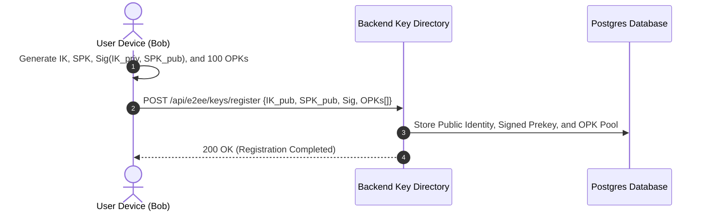
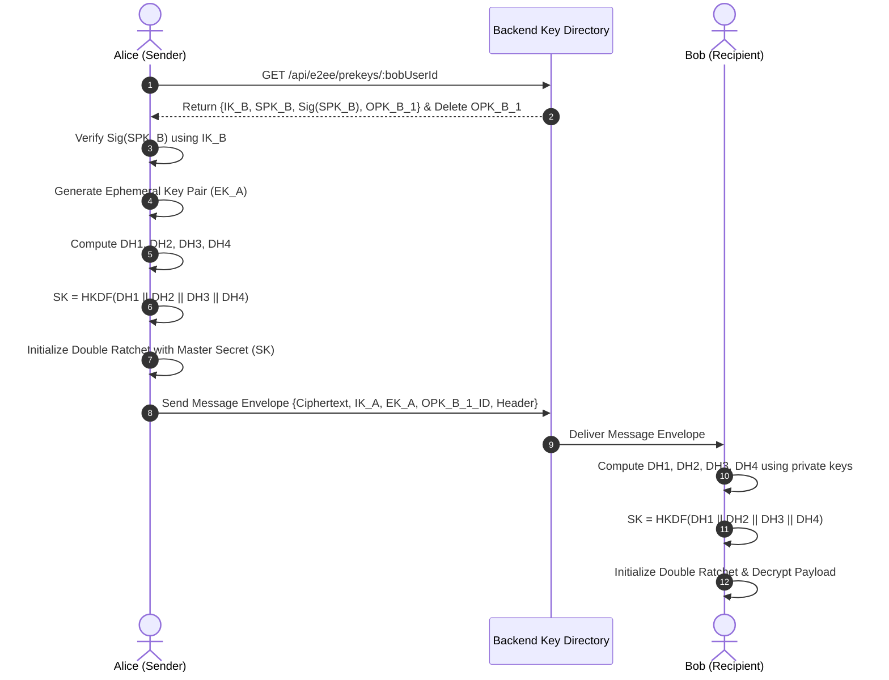
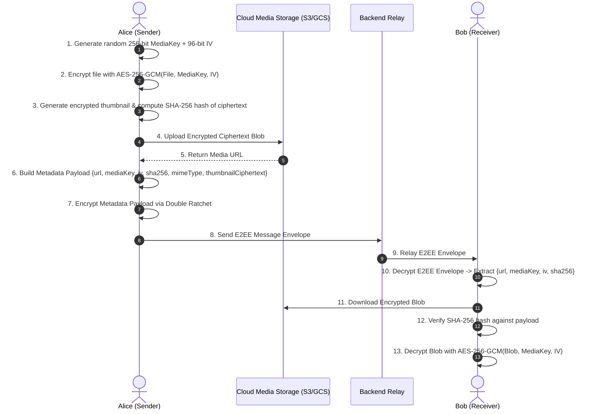

# End-to-End Encryption (E2EE) System Architecture & Implementation Guide

> **Document Version**: 1.0.0  
> **Status**: Approved Blueprint  
> **Scope**: Backend & Client-Side Cryptographic Infrastructure, Key Management, Session Ratcheting, Zero-Knowledge Relays, and Secure Media Pipelines.

---

## Table of Contents
1. [Executive Summary & Security Objectives](#1-executive-summary--security-objectives)
2. [Cryptographic Primitives & Standards](#2-cryptographic-primitives--standards)
3. [Key Hierarchy & Lifecycle](#3-key-hierarchy--lifecycle)
4. [Step-by-Step E2EE Workflow](#4-step-by-step-e2ee-workflow)
   - 4.1 Client Key Registration & Prekey Management
   - 4.2 Asynchronous Key Agreement (X3DH Protocol)
   - 4.3 Continuous Message Encryption (Double Ratchet Algorithm)
   - 4.4 Out-of-Band Encrypted Media Pipeline
   - 4.5 Group Messaging Architecture (Sender Keys)
5. [Backend Database Schema & Data Models](#5-backend-database-schema--data-models)
6. [Backend API Contracts & WebSocket Payloads](#6-backend-api-contracts--websocket-payloads)
7. [Device Management & Multi-Device Synchronization](#7-device-management--multi-device-synchronization)
8. [MITM Prevention & Safety Number Verification](#8-mitm-prevention--safety-number-verification)
9. [Zero-Knowledge Push Notifications & Offline Queuing](#9-zero-knowledge-push-notifications--offline-queuing)
10. [Threat Modeling, Best Practices & Security Anti-Patterns](#10-threat-modeling-best-practices--security-anti-patterns)

---

## 1. Executive Summary & Security Objectives

In this End-to-End Encryption (E2EE) architecture, the backend application server and database are treated as **untrusted, zero-knowledge transport relays**.

```
+------------------+         Encrypted Ciphertext Envelope         +------------------+
|   Client Node    | --------------------------------------------> |  Backend Server  |
|     (Alice)      | <-------------------------------------------- | (Zero Knowledge) |
+------------------+                 TLS 1.3 Pipe                  +------------------+
         |                                                                   |
         |                   End-to-End Encrypted Payload                    |
         +==================================================================>+
                                                                             |
                                                                   +------------------+
                                                                   |   Client Node    |
                                                                   |      (Bob)       |
                                                                   +------------------+
```

### Core Security Guarantees
- **Confidentiality**: Only the sender and recipient have access to the plain text content.
- **Integrity & Authenticity**: Every message is cryptographically authenticated using AEAD (Authenticated Encryption with Associated Data).
- **Forward Secrecy (FS)**: Compromise of current keys does not compromise past communications.
- **Post-Compromise Security (PCS / Break-in Recovery)**: Compromise of current keys does not permanently compromise future communications; the session heals automatically on subsequent exchanges.
- **Zero-Knowledge Storage**: Message bodies, attachments, thumbnails, and preview data stored on the server or CDN are strictly binary ciphertexts.

---

## 2. Cryptographic Primitives & Standards

The implementation adheres to audited, industry-standard cryptographic primitives:

| Component | Standard / Primitive | Description & Key Size |
| :--- | :--- | :--- |
| **Asymmetric Curve** | `Curve25519` / `Ed25519` | 256-bit elliptic curve for Diffie-Hellman (X25519) and digital signatures (Ed25519). |
| **Key Agreement** | **X3DH** (Extended Triple Diffie-Hellman) | Asynchronous mutual authentication and shared secret agreement. |
| **Ratcheting** | **Double Ratchet Algorithm** | Symmetric KDF ratchet combined with asymmetric DH ratchet. |
| **Symmetric Encryption** | `AES-256-GCM` or `ChaCha20-Poly1305` | 256-bit key, 96-bit unique IV/Nonce, 128-bit authentication tag. |
| **Key Derivation (KDF)** | `HKDF-SHA256` / `HKDF-SHA512` | HMAC-based Extract-and-Expand Key Derivation Function. |
| **Hashing & Digests** | `SHA-256` / `SHA-512` | Collision-resistant cryptographic hashing for digests and fingerprints. |

---

## 3. Key Hierarchy & Lifecycle

Every registered user client maintains a distinct set of cryptographic key pairs:

```
                            [ User Device ]
                                   │
      ┌────────────────────────────┼────────────────────────────┐
      ▼                            ▼                            ▼
[ Identity Key (IK) ]    [ Signed Prekey (SPK) ]    [ One-Time Prekeys (OPKs) ]
- Long-term              - Medium-term (7-30 days)  - Ephemeral (Single-use)
- Identity anchor        - Signed by IK             - Pool of 50-100 keys
- Ed25519 / X25519       - Rotated periodically     - Consumed & deleted
```

1. **Identity Key (`IK`)**:
   - Long-term identity key pair.
   - Private key stored strictly in secure hardware-backed storage (iOS Keychain, Android KeyStore, or non-extractable Web Crypto IndexedDB).
2. **Signed Prekey (`SPK`)**:
   - Medium-term X25519 key pair signed by the Identity Key: `Signature = Sign(IK_priv, SPK_pub)`.
   - Rotated periodically (e.g., every 7 to 14 days) to maintain forward secrecy.
3. **One-Time Prekeys (`OPK_1 ... OPK_n`)**:
   - Pool of single-use X25519 key pairs generated in batches (50–100).
   - Once a prekey is consumed by a sender, the server permanently deletes it from the directory.
   - The client replenishes the pool when the count drops below a threshold (e.g., < 20).

---

## 4. Step-by-Step E2EE Workflow

### 4.1 Client Key Registration & Prekey Management



1. Upon registration or initial device setup, the client generates:
   - Identity Key Pair $(IK_{pub}, IK_{priv})$.
   - Signed Prekey Pair $(SPK_{pub}, SPK_{priv})$ with signature $\text{Sign}_{IK_{priv}}(SPK_{pub})$.
   - 100 One-Time Prekey Pairs $(OPK_{1..100, pub}, OPK_{1..100, priv})$.
2. The client uploads **only public keys and signatures** to the backend API (`/api/e2ee/keys/register`).
3. Private keys are written to device secure storage.

---

### 4.2 Asynchronous Key Agreement (X3DH Protocol)

When Alice initiates a chat session with Bob (even if Bob is completely offline):



#### Diffie-Hellman Calculation Steps
1. Alice generates an ephemeral key pair: $(EK_{A,pub}, EK_{A,priv})$.
2. Alice calculates 4 Diffie-Hellman operations:
   $$\begin{aligned}
   DH_1 &= \text{X25519}(IK_{A,priv}, SPK_{B,pub}) \\
   DH_2 &= \text{X25519}(EK_{A,priv}, IK_{B,pub}) \\
   DH_3 &= \text{X25519}(EK_{A,priv}, SPK_{B,pub}) \\
   DH_4 &= \text{X25519}(EK_{A,priv}, OPK_{B,pub}) \quad \text{(if OPK exists)}
   \end{aligned}$$
3. Derive the master shared secret:
   $$SK = \text{HKDF-SHA256}(DH_1 \parallel DH_2 \parallel DH_3 \parallel DH_4, \text{salt}, \text{"X3DH-MasterSecret"})$$

---

### 4.3 Continuous Message Encryption (Double Ratchet Algorithm)

Once the shared master secret $SK$ is derived, Alice and Bob transition into the **Double Ratchet** protocol for all subsequent messaging.

```
                  [ Root Key (RK) ]
                          │
                   (DH Step Ratchet)
                          │
             ┌────────────┴────────────┐
             ▼                         ▼
   [ Sending Chain Key ]      [ Receiving Chain Key ]
             │                         │
     (Symmetric KDF)            (Symmetric KDF)
             │                         │
     ┌───────┴───────┐         ┌───────┴───────┐
     ▼               ▼         ▼               ▼
[ Next ChainKey ] [MessageKey] [ Next ChainKey ] [MessageKey]
                         │                             │
                  (AES-256-GCM)                 (AES-256-GCM)
                         │                             │
                    [Ciphertext]                  [Plaintext]
```

1. **Symmetric Ratchet (Per-Message)**:
   - Every sent/received message advances the Symmetric KDF chain.
   - Yields a fresh single-use **Message Key (`MK`)** and an updated **Chain Key (`CK`)**.
   - `MK` is used to encrypt the plaintext using `AES-256-GCM` with a unique IV.
   - `MK` is immediately wiped from client memory after encryption/decryption (Forward Secrecy).
2. **Diffie-Hellman Ratchet (Turn-by-Turn)**:
   - When a reply is received containing a new public DH ratchet key, the Root Key chain advances with a new DH exchange.
   - This creates a new Sending/Receiving chain, providing Post-Compromise Security (Break-in Recovery).

---

### 4.4 Out-of-Band Encrypted Media Pipeline

To keep the message stream fast and memory-efficient, binary files (images, audio, video, documents) are encrypted out-of-band:



---

### 4.5 Group Messaging Architecture (Sender Keys)

For 1-to-many group chats, **Sender Keys Protocol** is employed to avoid the $O(N^2)$ overhead of pairwise encryption:

```
[ Alice in Group ]
  ├── 1. Generates 256-bit Sender Key + Sender Chain
  ├── 2. Sends Sender Key to (Bob, Charlie, Dave) via 1:1 Pairwise E2EE
  └── 3. Encrypts group message ONCE with Sender Key -> Server broadcasts ciphertext to all members
```

1. **Sender Key Distribution**:
   - Alice creates a group `Sender Key` (comprising a Chain Key and a Signature Key).
   - Alice distributes this `Sender Key` to each participant via their private 1:1 pairwise E2EE sessions.
2. **Group Message Transmission**:
   - Alice encrypts the message payload once with her current `Sender Key` ratchet.
   - The server receives the single ciphertext and fans it out to all group recipients.
3. **Group Key Rotation (Ratcheting & Member Leaving)**:
   - When a member leaves or is removed, remaining members discard Alice's old sender key.
   - Alice generates a fresh Sender Key and redistributes it exclusively to the remaining active members.

---

## 5. Backend Database Schema & Data Models

The backend database stores only public keys, encrypted message envelopes, and delivery state.

```sql
-- 1. Identity & Prekey Directory Table
CREATE TABLE user_e2ee_keys (
    user_id UUID PRIMARY KEY REFERENCES users(id) ON DELETE CASCADE,
    identity_key_pub TEXT NOT NULL,         -- Base64 encoded Curve25519 Identity Public Key
    signed_prekey_pub TEXT NOT NULL,       -- Base64 encoded Curve25519 Signed Prekey
    signed_prekey_id INTEGER NOT NULL,
    signed_prekey_sig TEXT NOT NULL,       -- Base64 signature by identity key
    signed_prekey_created_at TIMESTAMP WITH TIME ZONE DEFAULT NOW(),
    updated_at TIMESTAMP WITH TIME ZONE DEFAULT NOW()
);

-- 2. One-Time Prekey Pool Table
CREATE TABLE user_one_time_prekeys (
    id BIGSERIAL PRIMARY KEY,
    user_id UUID NOT NULL REFERENCES users(id) ON DELETE CASCADE,
    key_id INTEGER NOT NULL,
    public_key TEXT NOT NULL,              -- Base64 encoded One-Time Prekey Public Key
    consumed BOOLEAN DEFAULT FALSE,
    consumed_at TIMESTAMP WITH TIME ZONE,
    created_at TIMESTAMP WITH TIME ZONE DEFAULT NOW(),
    UNIQUE(user_id, key_id)
);
CREATE INDEX idx_user_prekeys_active ON user_one_time_prekeys(user_id) WHERE consumed = FALSE;

-- 3. Encrypted Message Envelopes Table
CREATE TABLE encrypted_messages (
    id UUID PRIMARY KEY DEFAULT gen_random_uuid(),
    conversation_id UUID NOT NULL REFERENCES conversations(id) ON DELETE CASCADE,
    sender_id UUID NOT NULL REFERENCES users(id),
    recipient_id UUID REFERENCES users(id), -- Nullable for group chats
    message_type VARCHAR(32) NOT NULL DEFAULT 'text', -- 'text', 'media', 'prekey_init', 'sender_key_dist'
    
    -- E2EE Envelope Payload
    ratchet_header_pub TEXT NOT NULL,       -- Base64 Sender Ratchet Public Key
    counter INTEGER NOT NULL DEFAULT 0,    -- Message sequence counter in ratchet chain
    previous_counter INTEGER NOT NULL DEFAULT 0,
    ciphertext TEXT NOT NULL,              -- Base64 Encrypted Ciphertext
    auth_tag TEXT NOT NULL,                -- Base64 128-bit AEAD Auth Tag
    iv TEXT NOT NULL,                      -- Base64 96-bit IV/Nonce
    
    -- Delivery & Receipt Tracking (Ticks)
    status VARCHAR(20) NOT NULL DEFAULT 'sent', -- 'sent' (1 tick), 'delivered' (2 gray ticks), 'read' (2 blue ticks)
    created_at TIMESTAMP WITH TIME ZONE DEFAULT NOW(),
    delivered_at TIMESTAMP WITH TIME ZONE,
    read_at TIMESTAMP WITH TIME ZONE
);
CREATE INDEX idx_messages_conversation ON encrypted_messages(conversation_id, created_at);
CREATE INDEX idx_messages_delivery_status ON encrypted_messages(recipient_id, status);

-- 4. Group Sender Key Distribution Table
CREATE TABLE group_sender_key_distributions (
    id BIGSERIAL PRIMARY KEY,
    group_id UUID NOT NULL REFERENCES conversations(id) ON DELETE CASCADE,
    sender_id UUID NOT NULL REFERENCES users(id),
    recipient_id UUID NOT NULL REFERENCES users(id),
    encrypted_sender_key TEXT NOT NULL,    -- E2EE encrypted with 1:1 pairwise session
    created_at TIMESTAMP WITH TIME ZONE DEFAULT NOW(),
    UNIQUE(group_id, sender_id, recipient_id)
);
```

---

## 6. Backend API Contracts & WebSocket Payloads

### 6.1 Register Prekeys (Client -> Server)
- **Route**: `POST /api/v1/e2ee/keys/register`
- **Auth**: Bearer JWT

```json
{
  "identityKey": "MC4CAQAwBQYDK2VuBCIEI...",
  "signedPreKey": {
    "keyId": 1,
    "publicKey": "MC4CAQAwBQYDK2VuBCIEI...",
    "signature": "k3hF2+J..."
  },
  "oneTimePreKeys": [
    { "keyId": 101, "publicKey": "MC4CAQAwBQYDK2VuBCIEI..." },
    { "keyId": 102, "publicKey": "MC4CAQAwBQYDK2VuBCIEI..." }
  ]
}
```

### 6.2 Fetch Recipient Prekey Bundle (Client -> Server)
- **Route**: `GET /api/v1/e2ee/prekeys/:recipientUserId`
- **Response**:

```json
{
  "userId": "d7b43a91-4e78-4351-a968-3bf8f2a1b9c0",
  "identityKey": "MC4CAQAwBQYDK2VuBCIEI...",
  "signedPreKey": {
    "keyId": 1,
    "publicKey": "MC4CAQAwBQYDK2VuBCIEI...",
    "signature": "k3hF2+J..."
  },
  "oneTimePreKey": {
    "keyId": 101,
    "publicKey": "MC4CAQAwBQYDK2VuBCIEI..."
  }
}
```

### 6.3 Real-time WebSocket Message Envelope

```json
{
  "event": "e2ee:message:send",
  "data": {
    "conversationId": "conv_9381029",
    "recipientId": "usr_bob_8492",
    "isInitialSession": true,
    "x3dhHeader": {
      "ephemeralKey": "MC4CAQAwBQYDK2VuBCIEI...",
      "oneTimePreKeyId": 101
    },
    "ratchetHeader": {
      "ratchetKey": "MC4CAQAwBQYDK2VuBCIEI...",
      "counter": 0,
      "previousChainLength": 0
    },
    "iv": "3yZfW9e7rP4=",
    "ciphertext": "8kJwQz7+xLm5...",
    "authTag": "u4gT9w..."
  }
}
```

---

## 7. Device Management & Multi-Device Synchronization

To support multi-device environments (e.g., iPhone + macOS Web + iPad):

1. **Every Device is an Independent Endpoint**:
   - Each registered device generates its own distinct Identity Key, Signed Prekey, and OPK pool.
   - Devices are assigned a `deviceId` (e.g., `device_1`, `device_2`).
2. **Multi-Device Fan-Out Encryption**:
   - When Alice sends a message to Bob, Alice fetches the prekey bundles for **all active devices of Bob** + **all other devices of Alice**.
   - Alice creates individual pairwise ciphertexts for each device:
     $$\text{Ciphertext}_{\text{Bob-Phone}}, \quad \text{Ciphertext}_{\text{Bob-Mac}}, \quad \text{Ciphertext}_{\text{Alice-Mac}}$$
   - This ensures full conversation history synchronization across all authorized devices.

---

## 8. MITM Prevention & Safety Number Verification

To defend against rogue or compromised backend servers altering public keys:

```
Alice Device (IK_A) ──────── SHA-512 Hash ──────── Bob Device (IK_B)
                                  │
                                  ▼
                     [ 60-Digit Safety Number ]
                     34829-19284-91823-81723
                     81928-38192-48192-38192
                     84918-28391-49182-38192
                                  │
                                  ▼
                         [ QR Code Scan ]
```

1. **Safety Number Calculation**:
   $$\text{Fingerprint} = \text{SHA-512}(\text{Sort}(IK_{A,pub}, IK_{B,pub}))$$
2. The hash is truncated into a 60-digit numeric code formatted in twelve 5-digit groups or a 2D QR Code.
3. Users verify the safety number in-person or via a secondary trusted channel.
4. **Key Change Alert**: If a user re-registers or changes their Identity Key, the client automatically displays:
   > ⚠️ *"Safety number with Bob has changed. Tap to review and verify."*

---

## 9. Zero-Knowledge Push Notifications & Offline Queuing

Because the backend server cannot read message content, push notifications cannot contain plaintext snippets on the server:

1. **Generic Wakeup Payload**:
   ```json
   {
     "aps": {
       "alert": { "loc-key": "NEW_MESSAGE_NOTIFICATION" },
       "content-available": 1,
       "mutable-content": 1
     },
     "messageId": "msg_9812401"
   }
   ```
2. **Notification Service Extension (NSE)**:
   - On iOS / Android, the NSE wakes up in the background.
   - The extension downloads the encrypted envelope from the server, fetches local private keys from the OS Keychain, decrypts the message body locally, and displays the decrypted message in the local OS notification banner.

---

## 10. Threat Modeling, Best Practices & Security Anti-Patterns

### ✅ Best Practices & Hardening
- **Hardware-Backed Key Storage**: Always store private keys with OS Secure Enclave / KeyStore protection (`extractable = false`).
- **Memory Zeroization**: Explicitly clear/overwrite symmetric message keys in RAM immediately after use.
- **AEAD Mode Enforcement**: Reject any payload where the AEAD tag fails authentication before processing.
- **Replay Protection**: Maintain an indexed sliding window of received sequence numbers to drop replayed packets.

### ❌ Critical Anti-Patterns to Avoid
- **Never Generate Private Keys Server-Side**: Generating keys on the backend invalidates the zero-knowledge security model.
- **Never Reuse Nonces / IVs**: In `AES-GCM`, reusing an IV under the same key completely breaks confidentiality and allows ciphertext forgery.
- **Never Rely on TLS Alone**: TLS only protects transport between client and server; E2EE protects data against compromised servers and infrastructure.
- **Avoid Unauthenticated Symmetric Ciphers**: Never use raw `AES-CBC` or `AES-CTR` without an explicit HMAC.

---

## Verification & Audit Checklist

- [ ] All cryptographic algorithms use standard, audited libraries (`@signalapp/libsignal-client` or `libsodium`).
- [ ] Database contains zero plaintext data, attachments, or private keys.
- [ ] OPK pool depletion triggers automated client-side replenishment.
- [ ] Safety number calculation verified across test vectors.
- [ ] Progressive media upload verified: files are encrypted client-side prior to network transport.
